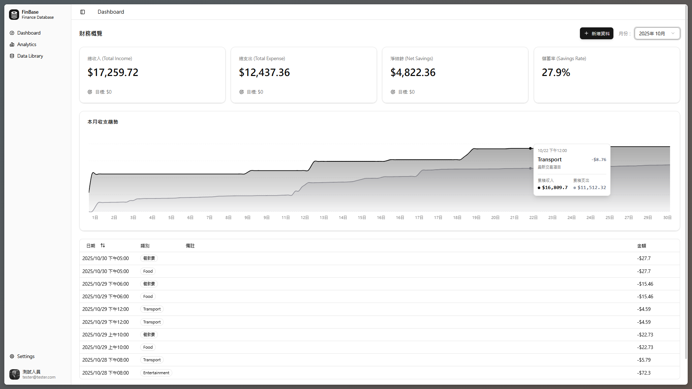
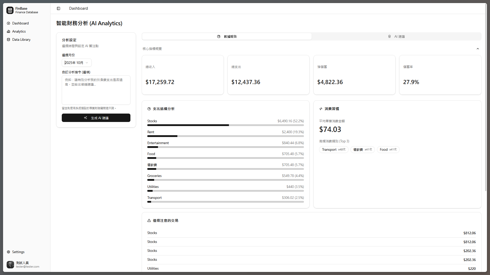
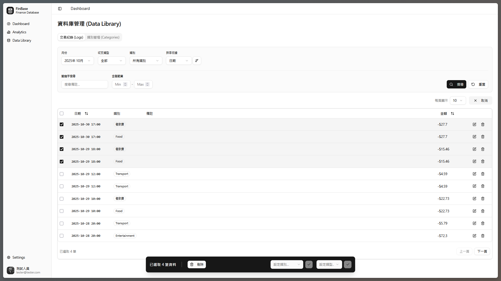
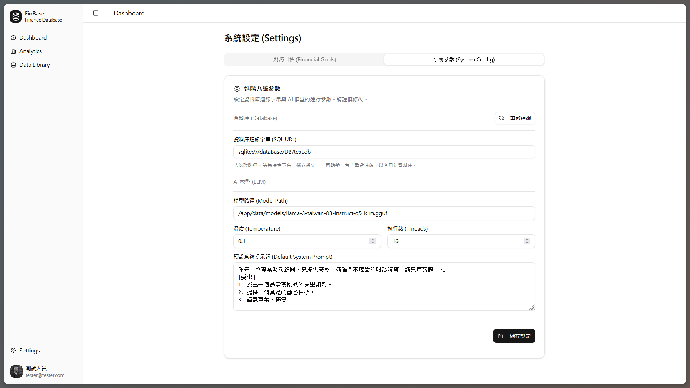
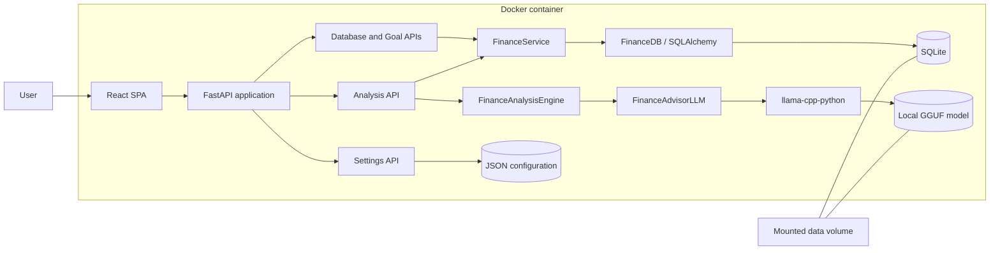
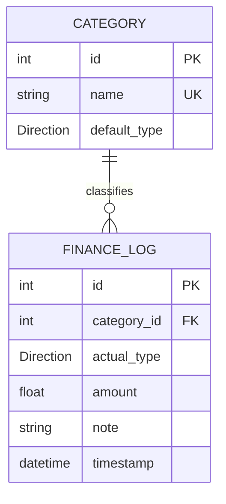
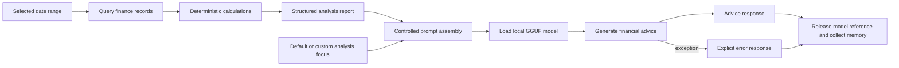

# FinBase

**A local-first personal finance product that turns transaction records into structured insights and locally generated financial advice.**

FinBase is an end-to-end portfolio project I independently designed and implemented to demonstrate product thinking, full-stack engineering, data modeling, Local LLM integration, UI/UX design, and containerized delivery.

> Designed and built a local-first personal finance system that combines deterministic financial analytics with privacy-preserving Local LLM assistance.



## What this project demonstrates

- **End-to-end product ownership:** turning a financial-management use case into a working interface, API, data model, analysis pipeline, and executable environment.
- **Full-stack integration:** a React SPA communicates with FastAPI services backed by SQLAlchemy and SQLite.
- **Applied Local LLM engineering:** deterministic financial calculations are transformed into a controlled prompt for a local GGUF model.
- **Product and UI/UX decisions:** summaries, filters, batch operations, goals, and AI controls are organized around common user tasks.
- **System delivery:** the frontend, backend, database, and model bootstrap process are packaged into a Docker-based runtime.

## Core product workflow

1. Record income or expenses and organize them with reusable categories.
2. Review monthly totals, savings rate, cumulative trends, and recent activity.
3. Search, filter, edit, or batch-manage the underlying transaction data.
4. Select an analysis period and optionally specify a financial concern.
5. Generate deterministic statistics before asking the Local LLM to interpret them.

The LLM is deliberately placed at the end of the workflow. It does not calculate balances or category totals; it receives a structured report and focuses on interpretation, prioritization, and actionable advice.

## Product walkthrough

### Financial overview

The Dashboard compresses the most important monthly signals into one view: total income, total expense, net savings, savings rate, cumulative trends, goals, and recent transactions. Month selection keeps the interface focused on a concrete review period.


### Deterministic analytics and AI advice

The Analytics workspace separates the statistical report from AI-generated advice. Users can select a month and add a custom focus without changing the underlying calculations.

The deterministic layer calculates category distribution, average transaction value, high-frequency categories, and unusually large expenses. The model then explains the resulting structure instead of reasoning over raw database rows.



### Data management

The Data Library supports filtering by month, direction, category, note keyword, amount range, and sort order. Selection mode enables batch category or direction changes while keeping destructive actions behind explicit confirmation.



### Local model configuration

Runtime settings expose the database URL, GGUF model path, inference temperature, thread count, and default system prompt. This makes the AI behavior inspectable and adjustable instead of hiding it behind a fixed endpoint.



## System architecture

FinBase is delivered as a React single-page application served by FastAPI. API routers delegate validation and business rules to the service layer, while analysis and generation remain separate from transaction persistence.



### Main request and data flow

- The frontend uses JSON APIs for transaction CRUD, filtered queries, goal reports, system settings, and analysis requests.
- FastAPI dependency overrides inject a shared `FinanceService` into database, goal, and analysis routes.
- `FinanceService` owns domain validation and response formatting; `FinanceDB` owns ORM queries and transaction boundaries.
- The built React application is served by FastAPI, so the portfolio can run as one application endpoint.
- SQLite data and model files live under the mounted `data/` directory so they persist outside the container.

## Data model and backend decisions



### Default direction versus actual direction

The most important modeling decision is storing direction in two different contexts:

- `Category.default_type` captures the normal behavior of a category, such as treating “Food” as an expense.
- `FinanceLog.actual_type` preserves what happened in a specific transaction.

This reduces input friction because selecting a category can automatically supply its usual direction, while exceptions remain possible. A restaurant refund can be recorded as income without changing the category default, and later category changes do not rewrite the meaning of historical transactions.

### Validation and consistency

- Categories use unique names and a constrained `Direction` enum.
- Transactions require an existing category, a positive numeric amount, and valid optional values.
- The service layer converts ORM objects into stable API-friendly dictionaries.
- Write operations commit on success and roll back on failure.
- Filtered queries support direction, category, amount range, date range, note keyword, sorting, and limits.

This design is intentionally small: it favors an understandable personal-finance domain model over accounting features such as multiple currencies, ledgers, reconciliation, or multi-user ownership.

## UI/UX decisions

- **Overview before detail:** the Dashboard answers “How am I doing this month?” before exposing individual records.
- **Progressive control:** common monthly actions stay visible, while advanced filters and model settings live in dedicated workspaces.
- **Defaults with exceptions:** category defaults reduce repetitive input without preventing corrections or refunds.
- **Safe batch operations:** selection state, a persistent action bar, and confirmation dialogs make large edits visible before execution.
- **AI as an explicit action:** advice is generated only when requested, with loading, success, empty-data, and error states.
- **Editable analysis intent:** users can provide a temporary focus for one analysis without permanently changing the default system prompt.

## Local LLM integration

FinBase uses `llama-cpp-python` to run a local GGUF instruction model. The integration is designed as a product pipeline rather than a general-purpose chat interface.



### Model input

The model receives a compact report containing:

- total income, total expense, net savings, and savings rate;
- expense totals and percentages by category;
- transactions above twice the average expense;
- high-frequency expense categories;
- the default system prompt or a request-specific focus.

### Model output and lifecycle

The output is concise Traditional Chinese financial guidance rendered by the frontend as Markdown. Temperature, token limit, context size, thread count, model path, and the default system prompt are configuration-driven.

The model is loaded when advice is requested and released afterward. This reduces persistent memory use on a local machine, at the cost of higher latency for every generation.

If there is no data, the API returns an explicit message without loading the model. If inference fails, it returns an error response; the current version does not provide a rule-based advice fallback.

## Docker execution

Docker packages the API, built frontend, SQLite access, Local LLM dependencies, model download bootstrap, and persistent data paths. The first start downloads the configured GGUF model (approximately 5.8 GB), so startup time depends on network speed and storage performance.

```bash
git clone https://github.com/TW-RF54732/FinBase.git
cd FinBase
docker compose up --build
```

The current Compose file builds the CUDA dependency profile and requests an NVIDIA device. For a CPU-only environment, change the Docker build argument to `DEVICE: cpu` and remove the NVIDIA device reservation before building.

> The CUDA image and device reservation are prepared, but `N_GPU_LAYERS` is not yet connected to the model constructor. The current code therefore does not claim active GPU layer offloading.

- Application: `http://localhost:8000`
- Health check: `http://localhost:8000/api/health`
- Demo credentials: `test` / `test`

For native Python setup and additional environment notes, see [Manual Setup](manualDownload.md).

## Technical tradeoffs and current limitations

| Decision | Benefit | Cost or limitation |
| --- | --- | --- |
| Local GGUF inference | Financial records do not need to be sent to a hosted model provider | Requires a large model download and hardware-dependent inference time |
| Deterministic analysis before generation | Totals and ratios remain reproducible and inspectable | Advice quality still depends on the selected model and prompt |
| Load the model per request | Releases memory after analysis | Adds model-loading latency to each request |
| SQLite persistence | Simple, portable, and appropriate for a local portfolio product | No multi-user concurrency or production database operations |
| Single-container delivery | Reproducible demonstration with a small operational surface | Not a horizontally scalable deployment architecture |

Additional boundaries:

- The login screen is a client-side demo gate using fixed credentials, not secure authentication.
- The application is designed for one local user and has no account isolation or authorization model.
- CORS is permissive for development.
- AI failures return an error instead of falling back to deterministic advice.
- CUDA dependencies are packaged, but runtime GPU layer offloading is not currently wired.
- The repository does not currently include an automated CI workflow or a full automated test suite.
- The system is a portfolio demonstration, not financial, investment, tax, or legal advice.

## Technology stack

| Area | Technology |
| --- | --- |
| Frontend | React 19, Vite, Tailwind CSS, Radix UI, TanStack Table, Recharts |
| API | FastAPI, Pydantic |
| Data and analysis | SQLAlchemy, SQLite, pandas |
| Local AI | llama-cpp-python, GGUF instruction model |
| Delivery | Docker, Docker Compose, Uvicorn |
